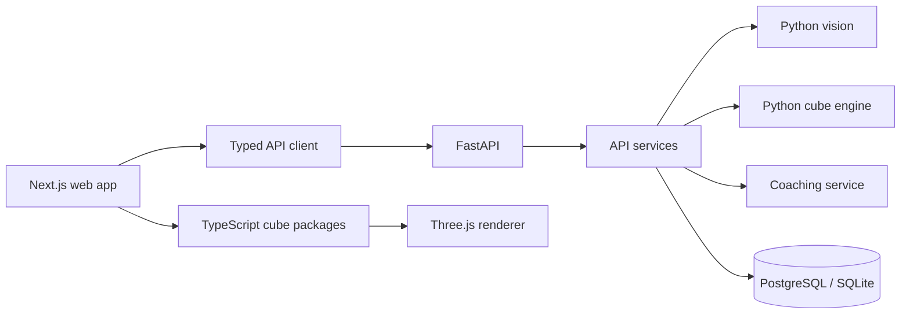

# Architecture

CubeAI is a monorepo. The web app, API, reusable TypeScript packages, Python services, and database schema live in separate top-level folders.



The diagram shows intended boundaries, not a fully connected user flow. The dashboard currently uses local state for its main interactions; some API services also contain placeholder behavior. See [Features](features.md) for those limits.

## Repository map

```text
apps/api/             FastAPI app, routes, services, and database access
apps/web/             Next.js App Router application
packages/cube-api/    Typed REST client, hooks, and API types
packages/cube-core/   TypeScript cube state and move engine
packages/cube-notation/Notation parsing and formatting
packages/cube-renderer/Three.js and SVG cube rendering
packages/cube-solver/ Search and Kociemba solver implementations
packages/shared/      Shared TypeScript types and constants
ai/                   Python engine, vision, and coaching modules
database/             SQL schema and migrations
tests/                TypeScript unit and web interaction tests
```

## Design boundaries

- Cube state and move logic should stay independent of React and rendering.
- The renderer displays state; it should not be the source of cube rules.
- API routes handle transport and validation; service modules hold application logic.
- Python vision and engine code can be used independently from the web app.

See [API](api.md) for routes and [Testing](testing.md) for the verification commands.